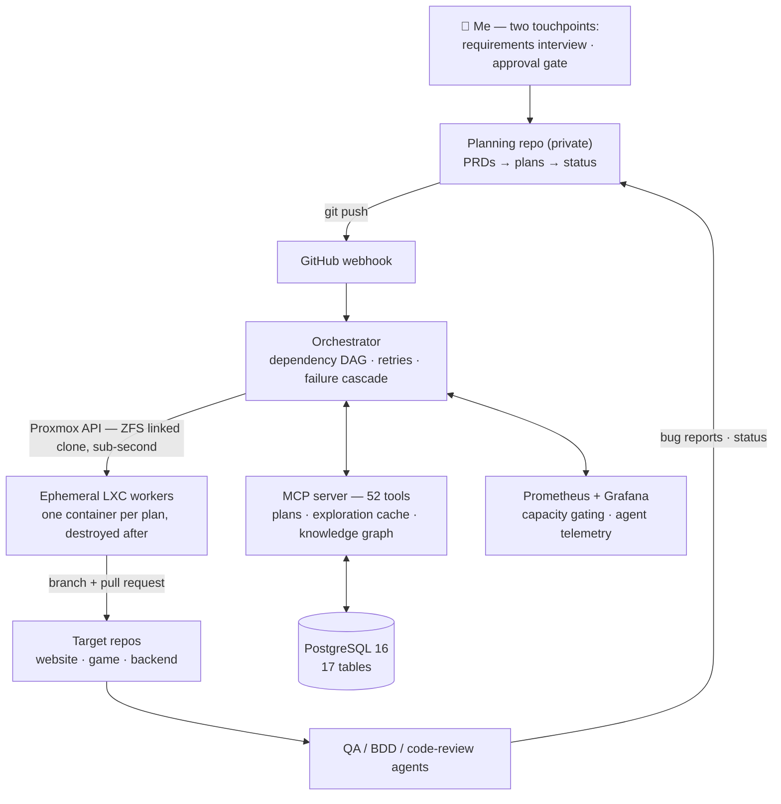

# FishTank

An AI-agent software delivery platform, and the live projects it builds and maintains.

**4,900+ commits · 1,375 plans written · 1,319 completed autonomously · 0 lines of human-written code in the target projects.**

FishTank is a one-person experiment taken to its logical end: what does software engineering look like when the engineer never writes the code? Over six months in 2026 I built a multi-agent orchestration system on top of Claude Code that takes a feature from an idea, through requirements and planning, to implementation, QA, code review, and deploy — with me participating at exactly two points: the requirements interview and the approval gate. Everything else runs autonomously on homelab infrastructure.

> **The platform's source is private** (planning repo, orchestrator, MCP server, agent definitions).
> This repo documents the architecture and hosts the public projects the platform maintains —
> the [the-fish-tank.com](https://the-fish-tank.com) site and its weather-prediction pipeline.

  

**Things it has shipped:**

- 🎣 **[Fathom Fall](https://fathomfall.com)** — a Phaser 3 roguelike (100 floors, 7 zones, asynchronous PvP ghost battles), playable now. Built end-to-end by agents. [Showcase →](https://github.com/GuppitusMaximus/fathom-fall-showcase)
- 🌊 **[the-fish-tank.com](https://the-fish-tank.com)** — interactive physics simulations, plus a weather-station ML pipeline. Both live in this repo.
- 📈 A quantitative trading research platform (private) — event-driven, exchange-safe, shadow-mode only. [Showcase →](https://github.com/GuppitusMaximus/tankcore-showcase)
- 🏗️ Its own infrastructure — the platform writes and maintains the Ansible code that runs it.

---

## Architecture

Plans are markdown files with metadata headers (`Status`, `Depends-on`, `Project`, `Review`). The orchestrator resolves them into a dependency DAG, deploys independent plans in parallel, retries failures twice with cooldown, and cascades permanent failures to dependent plans so nothing runs against a broken foundation. Capacity checks query Prometheus before every deploy cycle — the system throttles itself when the host is under load.

Each plan executes in an **ephemeral LXC container**: cloned from a template via ZFS linked clone in under a second, runs one agent with a hard timeout, pushes a branch, opens a PR, and is destroyed. If the hypervisor is unreachable, the orchestrator falls back to local execution.

## The part that answers "but do you trust the code?"

The interesting engineering problem isn't getting agents to write code — it's building the system that makes their output trustworthy. FishTank's answer is layered verification, all of it enforced, none of it honor-system:

- **Write permissions are enforced by a pre-tool-use hook**, not documentation. An implementation agent that tries to write outside its assigned project — or into the test directory it's supposed to be verified by — is hard-blocked at the tool-call level.
- **Separation of duties.** Implementation agents cannot touch tests. QA agents cannot touch production code. BDD agents write failing specs *before* the implementation agent starts. The agent that reviews and merges a PR is read-only.
- **A QA plan is paired with every implementation plan** — QA verifies against the plan's acceptance criteria and files structured bug reports, which flow back into new fix plans.
- **Everything is observable.** A custom Prometheus exporter tracks every agent's status, token velocity, step progress, and error counts; Grafana dashboards and mobile alerts surface stalls and failures in real time.

## Institutional memory

Agents are stateless; the platform isn't. An **exploration cache** stores what previous agents learned about every file they studied, with staleness detection against the working tree. A **knowledge graph** (components, request flows, dependencies, data shapes — PostgreSQL-backed) lets an agent ask "what breaks if I change this data model?" before it edits anything. Cached insights are injected into plans selectively, because the design principle underneath the whole system is **context discipline**: a narrow, relevant context outperforms a big one.

## The infrastructure

Runs on a single-node Proxmox homelab (Ryzen 7 7700, 64 GB DDR5, 2 TB NVMe on ZFS), fully managed as code:

- **12 Ansible roles across 5 hosts** — with Molecule tests, encrypted secrets, and daily automated drift detection that alerts if reality diverges from the code
- **Push-to-deploy** — a GitHub webhook wakes the orchestrator on push; it shuts itself down when the work queue is empty
- **Nightly ZFS snapshots** and PostgreSQL backups with automated restore tests
- **Cloudflare Tunnel + Access** for zero-open-ports remote entry; Tailscale for administration

---

## Live projects in this repo

The showcase above describes the private platform. The projects below live *in this repo* and are what it publicly maintains — the site deploys from `main` via GitHub Pages, and the weather pipeline runs on GitHub Actions.

### [the-fish-tank](FrontEnds/the-fish-tank/) — [the-fish-tank.com](https://the-fish-tank.com)

Interactive web experiences in vanilla HTML/CSS/JS, no frameworks:

- **Fish Tank** — click-to-spawn swimming fish with physics
- **Tank Battle** — autonomous combat vehicles with turret AI
- **Fighter Fish** — aerial dogfight with flight physics and missiles
- **Home** — temperature forecast powered by the-snake-tank's ML model

### [the-snake-tank](BackEnds/the-snake-tank/) — weather data + ML pipeline

- Collects readings from a Netatmo weather station on a GitHub Actions schedule
- Stores history in SQLite; trains a RandomForest model to predict next-hour indoor/outdoor temperature
- Publishes prediction JSON consumed by the site's forecast widget

---

## Build log

How the platform evolved — from a single Claude session to the orchestrated system above, one wall at a time — in [BUILDLOG.md](BUILDLOG.md).

## FAQ

**Why is the platform private?** Parts of it are directly monetizable, and the agent definitions and planning corpus are the product of months of iteration. The architecture is documented here precisely because the ideas are worth sharing even where the implementation isn't.

**Did agents really write all of it?** All application code in the target projects, yes — the numbers at the top are live counts from the planning repo. My contributions are requirements, plan approval, and the platform/infrastructure design itself.

**What's it built with?** Claude Code (agents), Python (orchestrator, MCP server, exporters), PostgreSQL 16, Prometheus/Grafana, Proxmox VE, LXC/ZFS, Ansible, Cloudflare.
