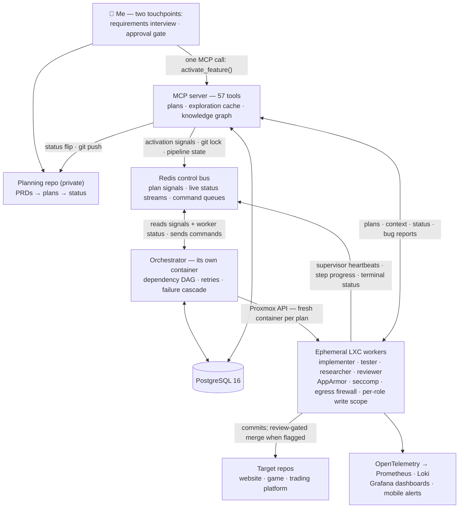

# FishTank

An AI-agent software delivery platform, and the live projects it builds and maintains.

**5,000+ commits · 1,732 plans written · 1,562 completed autonomously · 0 lines of human-written code in the target projects.**

FishTank is a one-person experiment taken to its logical end: what does software engineering look like when the engineer never writes the code? Over the course of 2026 I built a multi-agent orchestration system on top of Claude Code that takes a feature from an idea, through requirements and planning, to implementation, QA, code review, and deploy — with me participating at exactly two points: the requirements interview and the approval gate. Everything else runs autonomously on homelab infrastructure.

> **The platform's source is private** (planning repo, orchestrator, MCP server, agent definitions).
> This repo documents the architecture and hosts the public projects the platform maintains —
> the [the-fish-tank.com](https://the-fish-tank.com) site and its weather-prediction pipeline.

  

**Things it has shipped:**

- 🎣 **[Fathom Fall](https://fathomfall.com)** — a Phaser 3 roguelike (100 floors, 7 zones, asynchronous PvP ghost battles), playable now. Built end-to-end by agents. [Showcase →](https://github.com/GuppitusMaximus/fathom-fall-showcase)
- 🌊 **[the-fish-tank.com](https://the-fish-tank.com)** — interactive physics simulations, plus a weather-station ML pipeline. Both live in this repo.
- 📈 A quantitative trading research platform (private) — event-driven, exchange-safe, shadow-mode only. [Showcase →](https://github.com/GuppitusMaximus/tankcore-showcase)
- 🏗️ Its own infrastructure — the platform writes and maintains the Ansible code that runs it.

---

## Architecture

Plans are markdown files with metadata headers (`Status`, `Profile`, `Depends-on`, `Review`). The orchestrator is event-driven: a single MCP call activates approved plans, commits the state change, and signals it over a Redis control bus — there is no webhook and no deploy script, so there is exactly one way work enters the system. It resolves plans into a dependency DAG, deploys independent plans in parallel under a concurrency cap (plans touching overlapping files are sequenced instead), retries failures — except security violations, which are never retried — and cascades permanent failures to dependent plans so nothing runs against a broken foundation.

Each plan executes in an **ephemeral LXC container**, cloned fresh from a hardened template, with its own IP and credentials injected before first boot. The agent inside runs as one of four roles — implementer, tester, researcher, reviewer — under an AppArmor profile matched to that role, behind an egress firewall and a seccomp filter, with a bounded turn budget. It commits its work, a supervisor process reports terminal status, the container powers itself off, and the orchestrator archives the logs and destroys it. Plans flagged for review get a compliance + quality reviewer pair whose approval gates the merge.

## The part that answers "but do you trust the code?"

The interesting engineering problem isn't getting agents to write code — it's building the system that makes their output trustworthy. FishTank's answer is layered enforcement — and, as of this month, **measured** enforcement. A dedicated probe plan ran eight times inside live worker containers, deliberately writing where it shouldn't, to establish what each layer actually does rather than what the design says it does. The honest version turned out to be the stronger claim:

- **Write scope is enforced at three layers with different mechanisms.** A pre-tool-use hook refuses out-of-scope writes at the tool-call level with a readable reason; a per-role AppArmor profile enforces the same scope at the kernel, catching anything that bypasses the tooling; and a permissions pass makes existing files read-only. The probes verified the agent process is genuinely confined (its kernel security label reads `enforce`), and mapped each layer's *real* coverage: the hook sees only tool-mediated writes, the file-permissions layer does nothing against *creating* a new file — so an out-of-scope new file is stopped by two layers, not three — and AppArmor's deny path has never fired in a probe, because the hook always refuses first; its behavior is verified by inspection of the loaded profile, not by observation. Claiming exactly that, and no more, is the point.
- **The measurement mattered.** For the pipeline's entire prior history, the AppArmor profiles were loaded in enforce mode and attached to no process — confining nothing. Three probe runs reported false passes before the probe's own instrumentation bug was found (a check that discarded stderr, so "permission denied" was indistinguishable from "not loaded"). Nearly every defect the probes surfaced was one mistake in different costumes: a rule written against the path a human would name while the kernel, git, or the tooling evaluated a different one — resolved symlinks, atomic temp-file writes, directory nodes versus their contents. *Loaded ≠ applied* is now a regression test, not an assumption.
- **Separation of duties.** The implementer cannot touch tests (measured: refused). The tester can write test files and bug reports and nothing else (measured: six probes, expected outcome on all six, four consecutive runs). The reviewer that gates a merge is read-only at the kernel level. And no agent can rewrite its own rules — agent behavior definitions and repo-root config files are protected paths for every role.
- **A QA plan is paired with every implementation plan** — QA verifies against the plan's acceptance criteria and files structured bug reports, which flow back into new fix plans.
- **Everything is observable.** Agents stream OpenTelemetry — token velocity, tool calls, step progress, errors — through a collector into Prometheus and Loki; Grafana dashboards and mobile alerts surface stalls and failures in real time.

## Institutional memory

Agents are stateless — whatever one learns about the codebase dies with its session, and the next agent pays to rediscover it. At fleet scale that's the dominant cost: the same heavily-touched files get re-read by scoping, planning, implementation, and QA agents, feature after feature. The platform's answer is a shared memory layer (PostgreSQL-backed) with three tiers:

| Layer | What it holds | The question it answers |
|---|---|---|
| **Exploration cache** | Per-file summaries: what the file does, what it exports, which agent wrote the entry, staleness state | "What's in this file?" — without reading it |
| **Insight store** | One "landmine" per topic — gotchas that look correct but fail in non-obvious ways (`"NineSlice panels don't reposition on scale — setPosition after setScale"`) | "What will waste the next agent's hour?" |
| **Knowledge graph** | Components, directed dependency edges, traced request flows, data-shape catalogs | "What breaks if I change this?" — before editing |

**How it stays trustworthy** is the interesting part. Three population paths with different authority: rich summaries from dedicated scoping agents, lightweight auto-capture whenever any agent reads an uncached file (which never overwrites a rich entry), and automatic refresh of modified files when a plan completes. When a file changes underneath an entry, the entry is **marked stale rather than deleted** — a stale summary with a warning still gives directional context, which beats a blank. Daily drift detection compares the cache against the working tree and flags what diverged.

**Delivery is proactive, not reactive.** The planning agent embeds relevant gotchas directly into each plan at write time, and file reads arrive with cached context attached — the implementing agent gets warnings as part of its instructions, not as queries it might forget to make. Reactive lookup exists as a fallback for surprises. This follows the design principle underneath the whole system: **context discipline** — a narrow, relevant context produces measurably more reliable agent output than a big one.

**Measured, not vibes** (614 agent runs): cached summaries compress a file read ~48× (≈80 tokens vs ≈3,800), which across 985 plan-file touches saved **~5.5M tokens** on context injection alone; 185 cached insights help hold the autonomous success rate at ~92%; and the cache compounds — by the twentieth feature in a project, scoping finds 90%+ of relevant files already summarized, so each feature makes the next one cheaper.

## The infrastructure

Runs on a single-node Proxmox homelab (Ryzen 7 7700, 64 GB DDR5, 2 TB NVMe on ZFS), fully managed as code:

- **18 Ansible roles across 9 hosts** — with Molecule tests, encrypted secrets, and daily automated drift detection that alerts if reality diverges from the code
- **One deploy path** — a single MCP call activates approved plans and signals the orchestrator over a Redis control bus; worker containers power themselves off when done and are destroyed after their logs are archived
- **Nightly ZFS snapshots** and PostgreSQL backups with automated restore tests
- **Cloudflare Tunnel + Access** for zero-open-ports remote entry; Tailscale for administration

---

## Live projects in this repo

The showcase above describes the private platform. The projects below live *in this repo* and are what it publicly maintains — the site deploys from `main` via GitHub Pages, and the weather pipeline runs on GitHub Actions.

### [the-fish-tank](FrontEnds/the-fish-tank/) — [the-fish-tank.com](https://the-fish-tank.com)

Interactive web experiences in vanilla HTML/CSS/JS, no frameworks:

- **Fish Tank** — click-to-spawn swimming fish with physics
- **Tank Battle** — autonomous combat vehicles with turret AI
- **Fighter Fish** — aerial dogfight with flight physics and missiles
- **Home** — temperature forecast powered by the-snake-tank's ML model

### [the-snake-tank](BackEnds/the-snake-tank/) — weather data + ML pipeline

- Collects readings from a Netatmo weather station on a GitHub Actions schedule
- Stores history in SQLite; trains a RandomForest model to predict next-hour indoor/outdoor temperature
- Publishes prediction JSON consumed by the site's forecast widget

---

## Build log

How the platform evolved — from a single Claude session to the orchestrated system above, one wall at a time — in [BUILDLOG.md](BUILDLOG.md).

## FAQ

**Why is the platform private?** Parts of it are directly monetizable, and the agent definitions and planning corpus are the product of months of iteration. The architecture is documented here precisely because the ideas are worth sharing even where the implementation isn't.

**Did agents really write all of it?** All application code in the target projects, yes — the numbers at the top are live counts from the planning repo. My contributions are requirements, plan approval, and the platform/infrastructure design itself.

**What's it built with?** Claude Code (agents), Python (orchestrator, MCP server, supervisor), PostgreSQL 16, Redis, OpenTelemetry + Prometheus/Loki/Grafana, Proxmox VE, LXC/ZFS, AppArmor/seccomp, Ansible, Packer, Cloudflare.
