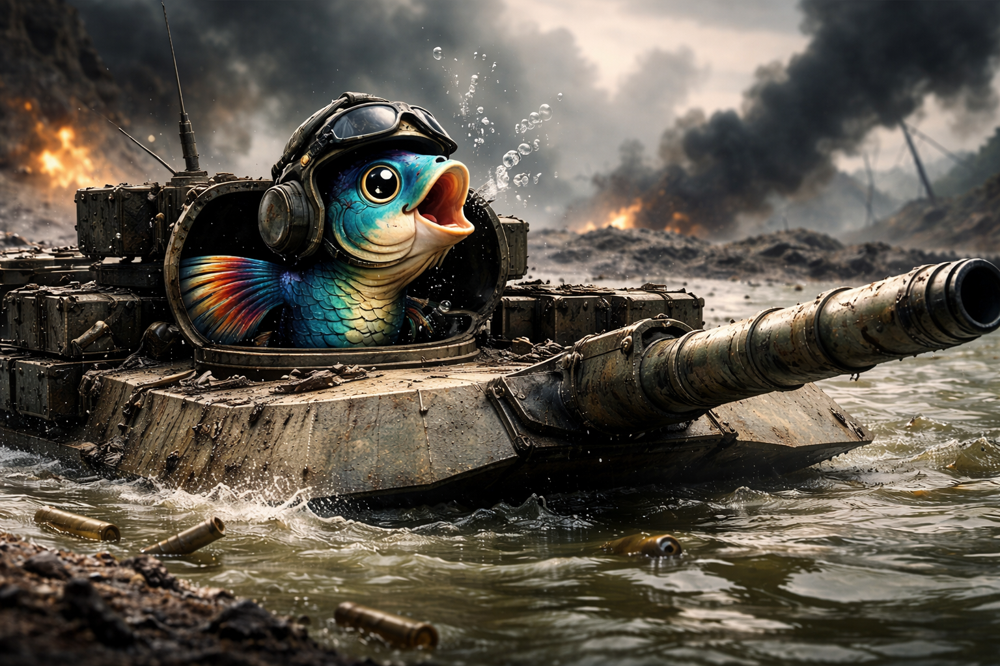
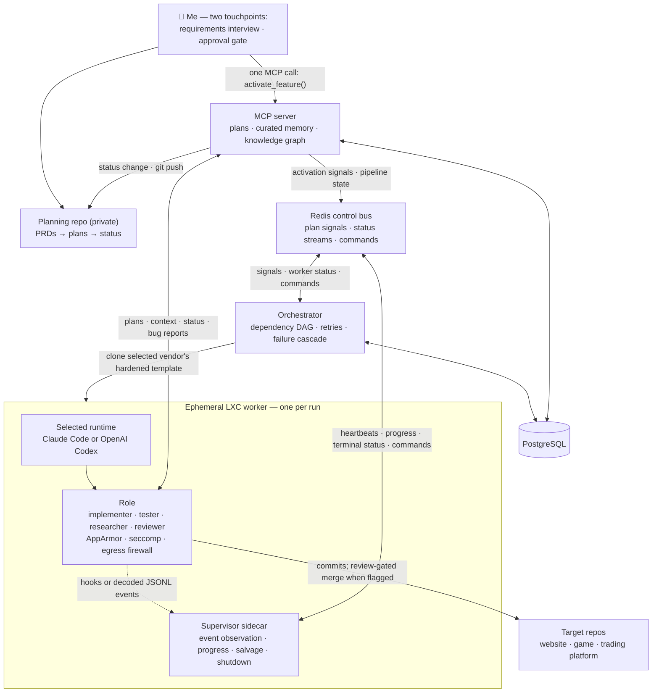

# FishTank

An AI-agent software delivery platform, and the live projects it builds and maintains.

FishTank is a one-person experiment taken to its logical end: what does software engineering look like when the engineer never writes the application code? I built a multi-agent orchestration system around Claude Code and OpenAI Codex that takes a feature from an idea, through requirements and planning, to implementation, QA, code review, and deploy — with me participating at exactly two points: the requirements interview and the approval gate. Everything else runs autonomously on homelab infrastructure.

> **The platform's source is private** (planning repo, orchestrator, MCP server, agent definitions).
> This repo documents the architecture and hosts the public projects the platform maintains —
> the [the-fish-tank.com](https://the-fish-tank.com) site and its weather-prediction pipeline.

  

**Things it has shipped:**

- 🎣 **[Fathom Fall](https://fathomfall.com)** — a Phaser 3 roguelike (100 floors, 7 zones, asynchronous PvP ghost battles), playable now. Built end-to-end by agents. [Showcase →](https://github.com/GuppitusMaximus/fathom-fall-showcase)
- 🌊 **[the-fish-tank.com](https://the-fish-tank.com)** — interactive physics simulations, plus a weather-station ML pipeline. Both live in this repo.
- 📈 A quantitative trading research platform (private) — event-driven, exchange-safe, shadow-mode only. [Showcase →](https://github.com/GuppitusMaximus/tankcore-showcase)
- 🏗️ Its own infrastructure — the platform writes and maintains the Ansible code that runs it.

---

## Architecture

```mermaid
flowchart TD
    U["👤 Me — two touchpoints:\nrequirements interview · approval gate"] --> P["Planning repo (private)\nPRDs → plans → status"]
    U -->|"one MCP call: activate_feature()"| M["MCP server\nplans · curated memory · knowledge graph"]
    M -->|"status change · git push"| P
    M -->|"activation signals · pipeline state"| B["Redis control bus\nplan signals · status streams · commands"]
    B <-->|"signals · worker status · commands"| O["Orchestrator\ndependency DAG · retries · failure cascade"]
    O <--> DB[("PostgreSQL")]
    M <--> DB
    subgraph C["Ephemeral LXC worker — one per run"]
        R["Selected runtime\nClaude Code or OpenAI Codex"]
        A["Role\nimplementer · tester · researcher · reviewer\nAppArmor · seccomp · egress firewall"]
        S["Supervisor sidecar\nevent observation · progress · salvage · shutdown"]
        R --> A
        A -.->|"hooks or decoded JSONL events"| S
    end
    O -->|"clone selected vendor's hardened template"| C
    S <-->|"heartbeats · progress · terminal status · commands"| B
    A <-->|"plans · context · status · bug reports"| M
    A -->|"commits; review-gated merge when flagged"| T["Target repos\nwebsite · game · trading platform"]
```

Plans are markdown files with metadata headers. A plan's `Profile` selects its role and write permissions; `Vendor` and `Model` select either a Claude Code or OpenAI Codex worker, including OpenAI/Sol (`gpt-5.6-sol`). The two runtimes use separate worker images and credentials but enter the same orchestration, dependency, review, and role-confinement pipeline. Vendor and model selections persist across retries and generated follow-up plans.

The orchestrator is event-driven. A single MCP call activates approved plans and signals them over a Redis control bus. It resolves a dependency DAG, deploys independent non-overlapping work in parallel, retries eligible failures, and stops dependants from running against a failed foundation.

Each worker run executes in a fresh LXC container as one of four roles — implementer, tester, researcher, or reviewer — with role-specific filesystem permissions and external confinement. Claude workers expose tool activity through hooks; Codex workers emit JSONL events that the supervisor decodes into the same liveness and progress stream. Codex has a wall-clock execution limit and controlled access to its model service through a dedicated forward proxy. Claude's turn-budget and telemetry behavior are not assumed to apply to Codex.

The supervisor sidecar is the worker's black box and exit handler. It reports heartbeats, inferred progress, and terminal status; preserves recoverable committed work after crashes; and participates in orderly worker shutdown. Plans flagged for review receive independent review before merge.

## The part that answers “but do you trust the code?”

The interesting engineering problem is not getting agents to write code — it is building a system that makes their output trustworthy. FishTank's answer is layered enforcement backed by live-container probes:

- **Write scope is enforced in layers.** Claude's pre-tool-use hook provides readable refusals for tool-mediated writes. Both runtimes use role-specific AppArmor policies at the kernel and filesystem permissions on protected existing files. The permissions pass cannot prevent creation of a new file in a writable directory, and Claude's hook does not extend to Codex. Those boundaries matter when interpreting the probe results.
- **Loaded is not the same as applied.** Early probes found AppArmor profiles loaded in enforce mode but attached to no agent process. A second bug in the probe itself hid the discrepancy. Checking the running process's actual confinement is now part of verification; a loaded policy alone is not evidence that a worker is confined.
- **Separation of duties.** Implementers cannot modify tests, testers can change tests and report defects but not application source, and reviewers are read-only. Agents cannot rewrite their own role definitions or protected repository policy.
- **Implementation and QA are paired.** QA checks acceptance criteria and produces structured findings that feed correction work.
- **Review gates are explicit.** Plans that require review do not merge merely because their worker finished.
- **Execution remains observable.** The supervisor records activity and status even when an agent forgets to narrate its own progress. Claude telemetry flows through OpenTelemetry into Prometheus and Loki, with Grafana dashboards. Codex JSONL activity and raw usage are captured by the supervisor; full budget and OpenTelemetry parity remain follow-up work.

## Institutional memory

Agents are stateless, so FishTank maintains a PostgreSQL-backed memory layer that lets one worker transfer useful context to the next:

| Layer | What it holds | The question it answers |
|---|---|---|
| **Exploration cache** | Agent-written per-file summaries, searchable patterns, provenance, and staleness | “What did the last careful reader learn about this file?” |
| **Insight store** | Curated, topic-keyed conventions and non-obvious landmines | “What mistake will look reasonable and waste the next hour?” |
| **Knowledge graph** | Components and file ownership, dependency links, and traced flows with verification timestamps | “What calls this, what does it call, and which flows cross it?” |
| **[Plan handoffs and journals](#replicants)** | Completed work, remaining steps, decisions, gotchas, and references to saved code | “Where did the previous worker stop, and how do I carry on?” |

The cache is deliberately curated. Reading a file does not manufacture a summary, and routine refresh does not rewrite agent-authored prose. When a tracked file changes or disappears, its summary remains available but is marked stale until an agent re-reads and deliberately replaces it. Project identities are normalized so aliases do not split one codebase's memory. Lookup can target an exact file or use ranked full-text search across insight topics, insight text, file summaries, and patterns, with substring fallback. Unfiltered queries return counts, and a separate file index shows coverage and staleness without dumping the whole cache into context.

The knowledge graph is file-oriented. A worker uses `query_graph` to look up the file it already has, a component, or a flow. Plan file retrieval injects matching ownership, callers, callees, and flow context automatically. Agents record observed dependencies through `map_link`, which resolves the endpoints and upserts the relationship. Components can own several files or claim a directory, and explicit symbols allow several components to share a module. Verification timestamps record when components and links were mapped or rechecked; a filesystem timestamp alone does not make them fresh.

Graph rebuilds run beside a real checkout, not on the database host. A client-side walker derives components and direct import links, then submits them through the same component and link primitives used for incremental mapping. Reconciliation removes missing machine-built entries while preserving missing agent-authored knowledge as stale unless an explicit prune is requested. The walker is intentionally structural: higher-level HTTP, event, gRPC, and database relationships still require evidence-based mapping by an agent.

Memory arrives where it is useful: cached file context and graph neighbourhoods are attached to plan files, while focused search remains available for surprises. The aim is not maximum context. It is the smallest trustworthy context that prevents rediscovery and exposes change impact before editing.

### Replicants

**A plan can outlive the worker executing it.** When an agent stops at a checkpoint or reaches an execution limit, the orchestrator can deploy a fresh worker — a **replicant** — to continue the same plan with a fresh context window. The handoff store and run journal provide the institutional memory for that unfinished work.

At a deliberate checkpoint, the agent commits and pushes its work, then calls `save_handoff` with what it completed, what remains, and the decisions or gotchas its successor needs. PostgreSQL stores that handoff and the run journal; Git stores the actual code. The supervisor independently records the exit, observed progress, and Git state, and attempts to preserve recoverable work if the agent exits before completing its own handoff.

The replicant calls `get_previous_attempt()` at startup to retrieve the agent and supervisor handoffs, step progress, recent journal entries, and recovery references. It checks the saved commits, recovers any available salvage branch, skips completed steps, and resumes at the first unfinished one. The predecessor's decisions and warnings arrive with the work, so its successor can continue without rediscovering them.

Replication keeps the same plan attempt and is capped at three replacements per attempt. A guard stops further replication when successive records show the same step and commit; the ordinary retry policy then applies. Eligible exits are checkpoints, turn-budget exhaustion, and Codex wall-clock timeouts. Explicit cancellation and security violations do not trigger replication, and Claude's advance budget warnings remain specific to its hook-based runtime.

## The infrastructure

FishTank runs on a single-node Proxmox homelab (Ryzen 7 7700, 64 GB DDR5, 2 TB NVMe, and a 2 × 12 TB ZFS mirror), fully managed as code:

- **Infrastructure as code** — Ansible roles, automated checks, encrypted secrets, and drift detection
- **One deploy path** — approved plans enter through the MCP activation path and the orchestrator owns worker lifecycle
- **Recoverability** — ZFS snapshots, database backups, and restore checks
- **Remote access** — Cloudflare Tunnel and Access for remote entry, with Tailscale for administration
- **Two isolated agent runtimes** — separate Claude and Codex worker images, shared role boundaries, and runtime-appropriate supervision

---

## Live projects in this repo

The showcase above describes the private platform. The projects below live *in this repo* and are what it publicly maintains — the site deploys from `main` via GitHub Pages, and the weather pipeline runs on GitHub Actions.

### [the-fish-tank](FrontEnds/the-fish-tank/) — [the-fish-tank.com](https://the-fish-tank.com)

Interactive web experiences in vanilla HTML/CSS/JS, no frameworks:

- **Fish Tank** — click-to-spawn swimming fish with physics
- **Tank Battle** — autonomous combat vehicles with turret AI
- **Fighter Fish** — aerial dogfight with flight physics and missiles
- **Home** — temperature forecast powered by the-snake-tank's ML model

### [the-snake-tank](BackEnds/the-snake-tank/) — weather data + ML pipeline

- Collects readings from a Netatmo weather station on a GitHub Actions schedule
- Stores history in SQLite; trains a RandomForest model to predict next-hour indoor/outdoor temperature
- Publishes prediction JSON consumed by the site's forecast widget

---

## Build log

How the platform evolved — from a single agent session to the orchestrated system above, one wall at a time — in [BUILDLOG.md](BUILDLOG.md).

## FAQ

**Why is the platform private?** Parts of it are directly monetizable, and the agent definitions and planning corpus are the product of months of iteration. The architecture is documented here precisely because the ideas are worth sharing even where the implementation is not.

**Did agents really write all of it?** Agents write the application code in the target projects. My contributions are requirements, plan approval, and the platform and infrastructure design.

**Can it use more than one coding agent?** Yes. A plan selects Claude Code or OpenAI Codex, plus a compatible model. Both run through the same orchestrator and role model, while their worker images, credentials, event capture, limits, and network paths remain runtime-specific.

**What's it built with?** Claude Code and OpenAI Codex, Python, PostgreSQL, Redis, Proxmox VE, LXC/ZFS, AppArmor/seccomp, Ansible, Packer, Cloudflare, and an observability stack built around supervisor events, OpenTelemetry, Prometheus, Loki, and Grafana.
